# SKY130 Module 1
## Inception of Open-Source EDA, OpenLANE and Sky130 PDK


---

## 📌 About This Module

This repository contains my learning and practical work for **SKY130 Module 1 - Inception of Open-Source EDA, OpenLANE and Sky130 PDK**.

The module covers the fundamentals of:

- Open-source EDA tools
- Digital ASIC design
- Chip, die, core, pads and IP
- RISC-V architecture
- Software to hardware flow
- SoC design
- RTL-to-GDS flow
- OpenLANE
- Sky130 PDK
- OpenLANE directory structure
- Design preparation
- RTL synthesis
- Synthesis reports and characterization

The practical work was performed using the **Sky130 PDK and OpenLANE flow**.

---

# 📚 Module 1 Contents

This module is divided into three major sections:

1. **SKY130_D1_SK1 - How to Talk to Computers**
2. **SKY130_D1_SK2 - SoC Design and OpenLANE**
3. **SKY130_D1_SK3 - Get Familiar with Open-Source EDA Tools**

---

# 1️⃣ SKY130_D1_SK1 - How to Talk to Computers

---

## SKY_L1 - Introduction to Chip, Die, Core, Pads and IP

This session introduces the basic physical organization of an integrated circuit.

### Topics Covered

- Chip
- Package
- Die
- Core
- Pads
- IP
- Macros
- Relationship between die, core and pads

### Basic Chip Structure

```text
                 CHIP / PACKAGE
        ┌────────────────────────────┐
        │                            │
        │            DIE             │
        │   ┌────────────────────┐   │
        │   │                    │   │
        │   │       CORE         │   │
        │   │                    │   │
        │   │   Digital Logic    │   │
        │   │                    │   │
        │   │   IPs / Macros     │   │
        │   │                    │   │
        │   └────────────────────┘   │
        │                            │
        │        PAD RING             │
        │                            │
        └────────────────────────────┘
```

### Chip

A chip is an integrated circuit containing electronic components fabricated on a semiconductor die.

### Die

The die is the physical piece of semiconductor material on which the circuit is fabricated.

### Core

The core contains the main digital logic and functional blocks of the design.

### Pads

Pads provide electrical connections between the internal circuitry and the outside world.

### IP

IP stands for **Intellectual Property**. An IP block is a reusable functional block used as part of a larger chip design.

### Screenshot

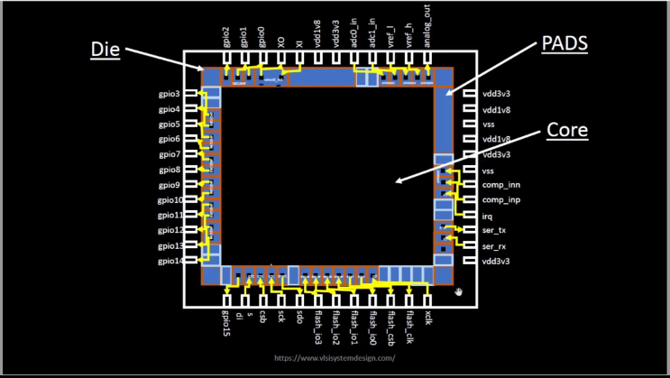

---

## SKY_L2 - Introduction to RISC-V

RISC-V is an open Instruction Set Architecture (ISA).

An ISA defines the instructions and programmer-visible behavior supported by a processor.

### Important Concepts

- Instruction Set Architecture
- RISC architecture
- Registers
- Instructions
- Processor
- Hardware implementation
- Open ISA

### RISC-V Design Flow

```text
Software
   ↓
Compiler
   ↓
RISC-V Instructions
   ↓
Processor RTL
   ↓
Logic Synthesis
   ↓
Gate-Level Netlist
   ↓
Physical Implementation
```

### RISC-V and RTL

The RISC-V instruction set can be implemented using RTL hardware description languages such as Verilog.

### Screenshot

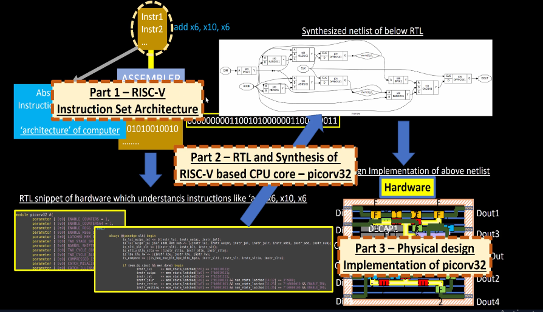

---

## SKY_L3 - From Software Applications to Hardware

A software application ultimately runs on hardware.

The overall transformation can be represented as:

```text
Application Software
        ↓
Programming Language
        ↓
Compiler
        ↓
Machine Instructions
        ↓
Instruction Set Architecture
        ↓
Processor Hardware
        ↓
Digital Logic
        ↓
Transistors
        ↓
Physical Chip
```

### Key Idea

Software describes what the system should do, while hardware provides the physical implementation that executes those operations.

### Screenshot

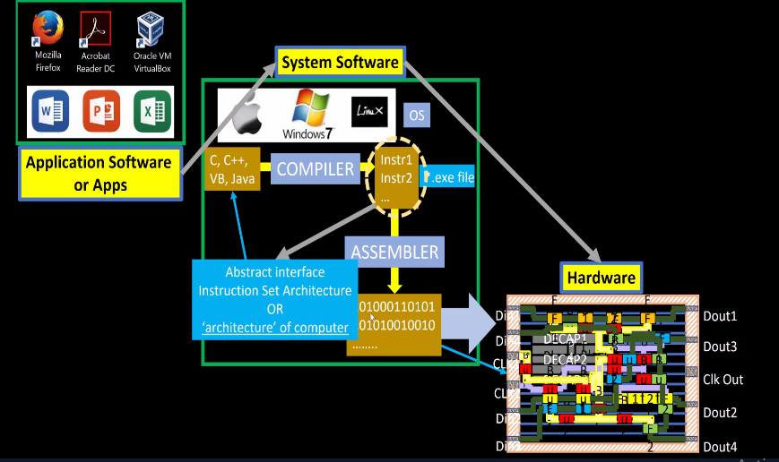

---

# 2️⃣ SKY130_D1_SK2 - SoC Design and OpenLANE

---

## SKY_L1 - Introduction to All Components of Open-Source Digital ASIC Design

Digital ASIC design involves multiple stages and tools.

### Major Components

- RTL design
- Simulation
- Synthesis
- Standard cell libraries
- Floorplanning
- Placement
- Clock Tree Synthesis
- Routing
- Physical verification
- Timing analysis
- GDS generation

### Open-Source ASIC Ecosystem

```text
RTL
 ↓
Simulation
 ↓
Synthesis
 ↓
Floorplan
 ↓
Placement
 ↓
CTS
 ↓
Routing
 ↓
Physical Verification
 ↓
GDS
```

### Open-Source EDA

Open-source EDA tools allow designers to perform many ASIC design tasks using publicly available tools and PDKs.

### Screenshot

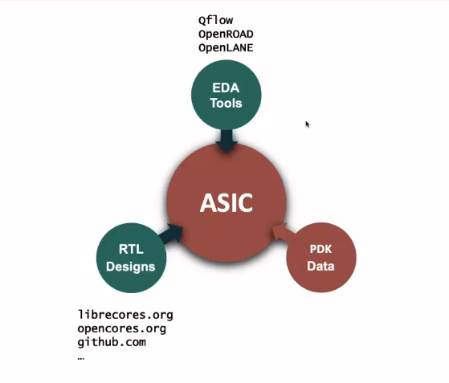

---

## SKY_L2 - Simplified RTL-to-GDS Flow

RTL-to-GDS is the process of converting a hardware description into a physical chip layout.

### Simplified Flow

```text
RTL Design
    ↓
Logic Synthesis
    ↓
Floorplanning
    ↓
Placement
    ↓
Clock Tree Synthesis
    ↓
Routing
    ↓
Physical Verification
    ↓
GDSII
```

### Important Stages

#### 1. RTL

Register Transfer Level describes the digital hardware behavior.

#### 2. Synthesis

RTL is converted into a gate-level netlist using standard cells.

#### 3. Floorplanning

The major physical regions of the design are planned.

#### 4. Placement

Standard cells are placed inside the core area.

#### 5. Clock Tree Synthesis

The clock network is created and optimized.

#### 6. Routing

Connections between cells are created using metal layers.

#### 7. GDS Generation

The final physical layout is represented in GDSII format.

### Screenshot

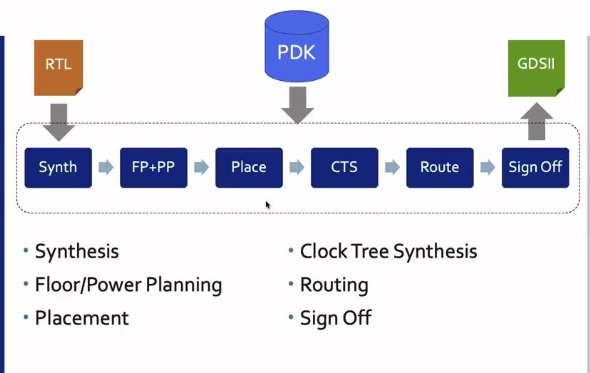

---

## SKY_L3 - Introduction to OpenLANE and STRIVE Chipsets

OpenLANE is an open-source automated digital ASIC implementation flow.

It integrates several open-source EDA tools into a complete RTL-to-GDS flow.

### General OpenLANE Flow

```text
RTL
 ↓
Synthesis
 ↓
Floorplanning
 ↓
Placement
 ↓
CTS
 ↓
Routing
 ↓
Signoff
 ↓
GDSII
```

### Main Purpose of OpenLANE

OpenLANE helps automate the physical implementation of digital designs while using an open-source ASIC design ecosystem.

### Sky130

The Sky130 PDK provides the technology information required to implement designs using the SkyWater 130 nm process.

### Screenshot

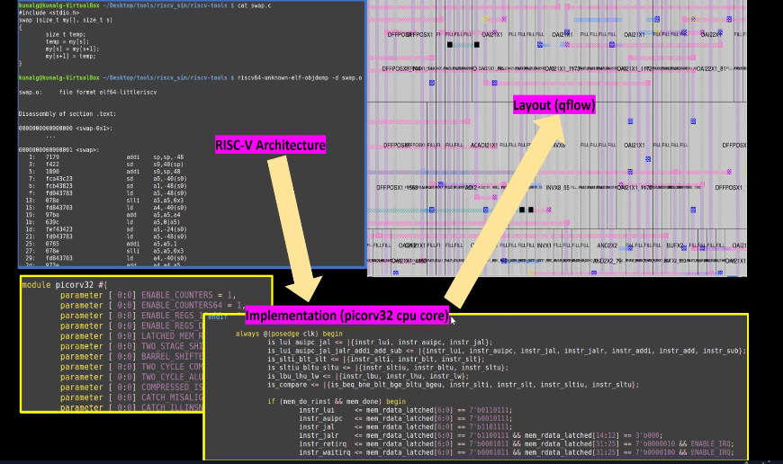

---

## SKY_L4 - Introduction to OpenLANE Detailed ASIC Design Flow

The detailed OpenLANE flow contains several implementation and optimization stages.

### Detailed Flow

```text
                 RTL DESIGN
                     │
                     ▼
              DESIGN SETUP
                     │
                     ▼
                SYNTHESIS
                     │
                     ▼
              FLOORPLANNING
                     │
                     ▼
                PLACEMENT
                     │
                     ▼
          CLOCK TREE SYNTHESIS
                     │
                     ▼
                  ROUTING
                     │
                     ▼
              SIGN-OFF CHECKS
                     │
                     ▼
                   GDSII
```

### Typical Physical Design Stages

- Synthesis
- Floorplan initialization
- IO placement
- Tapcell insertion
- PDN generation
- Global placement
- Optimization
- Clock Tree Synthesis
- Global routing
- Detailed routing
- Extraction
- Timing analysis
- Physical verification

### Screenshot

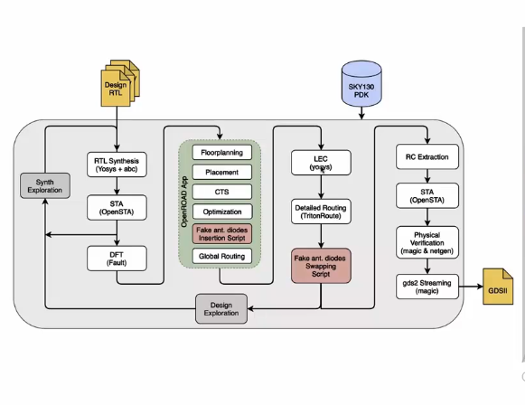

---

# 3️⃣ SKY130_D1_SK3 - Get Familiar with Open-Source EDA Tools

---

## SKY_L1 - OpenLANE Directory Structure in Detail

OpenLANE creates a structured directory for each design run.

A typical design run contains directories such as:

```text
run/
├── config.tcl
├── logs/
├── reports/
├── results/
├── tmp/
├── PDK_SOURCES/
└── OPENLANE_VERSION
```

### Important Directories

### logs/

Contains tool execution logs.

### reports/

Contains reports generated during the flow.

### results/

Contains important output files generated by different stages.

### tmp/

Contains temporary files generated during execution.

### config.tcl

Contains configuration parameters used for the design.

### Screenshot

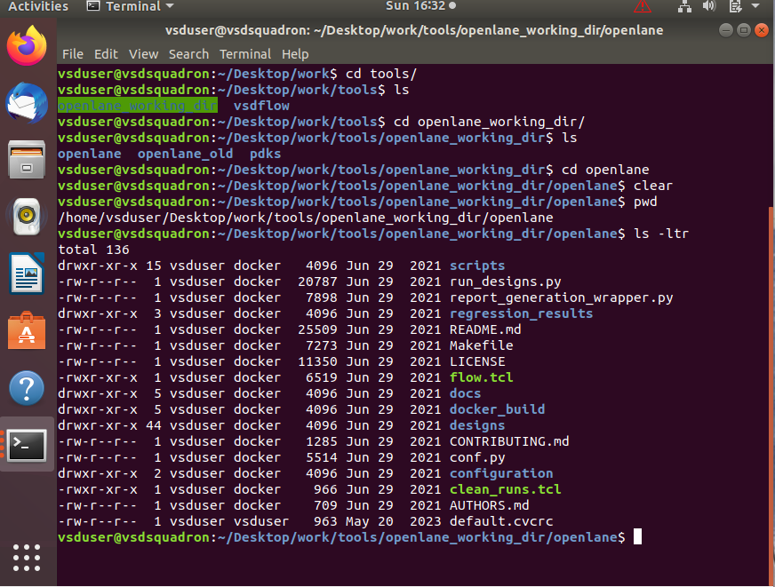

---

## SKY_L2 - Design Preparation Steps

Before running synthesis, OpenLANE prepares the design and technology files.

### Design Preparation

The design preparation stage includes:

- Loading the design configuration
- Loading the Sky130 PDK
- Loading standard cell libraries
- Preparing LEF files
- Preparing technology information
- Preparing the design environment
- Creating the run directory
- Merging required LEF files

### Example OpenLANE Commands

```text
package require openlane 0.9
prep -design picorv32a
```

The exact commands may vary depending on the OpenLANE version and setup.

### Screenshot

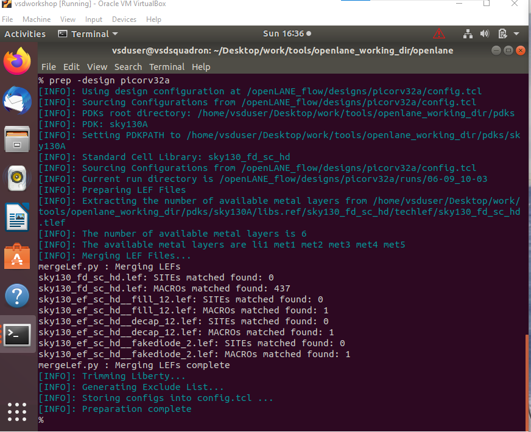

---

## SKY_L3 - Review Files After Design Prep and Run Synthesis

After design preparation, the generated run directory can be inspected.

### Example Directory

```text
runs/
└── 06-09-10-03/
    ├── config.tcl
    ├── logs/
    ├── reports/
    ├── results/
    ├── tmp/
    ├── PDK_SOURCES/
    └── OPENLANE_VERSION
```

### Synthesis

Synthesis converts RTL into a gate-level representation using cells from the standard cell library.

### Synthesis Output

For the PicoRV32A design, a synthesized Verilog netlist can be generated.

Example output:

```text
results/
└── synthesis/
    └── picorv32a.synthesis.v
```

### Screenshot - Synthesis Results

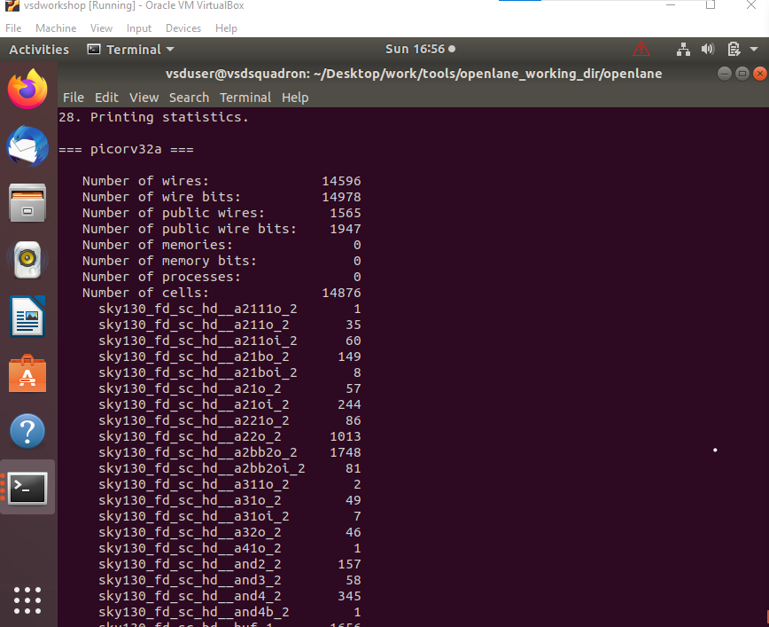

### Screenshot - Synthesis Reports

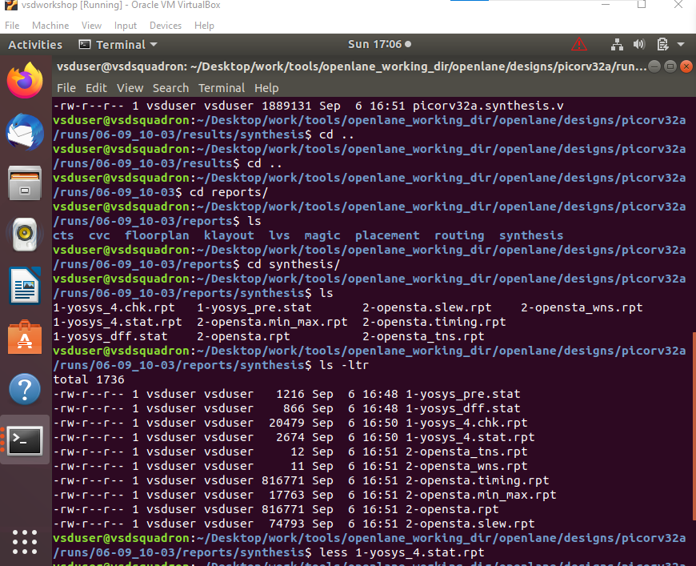

---

## SKY_L4 - OpenLANE Project Git Link Descriptions

The OpenLANE project contains source code, configuration files, scripts and tool integration required for the ASIC flow.

### Important Concepts

- Git repository
- Source files
- Configuration files
- Scripts
- PDK
- Standard cell libraries
- Design run directories
- Logs
- Reports
- Results

Understanding the project structure makes it easier to identify where inputs and outputs are generated during the ASIC flow.

### Screenshot


---

## SKY_L5 - Steps to Characterize Synthesis

Synthesis results can be analyzed using different metrics.

### Important Synthesis Metrics

- Number of cells
- Sequential cells
- Combinational cells
- Total cell area
- Timing
- Clock information
- Utilization
- Gate count

### Cell Statistics

The synthesized design contains different standard cells used to implement the RTL functionality.

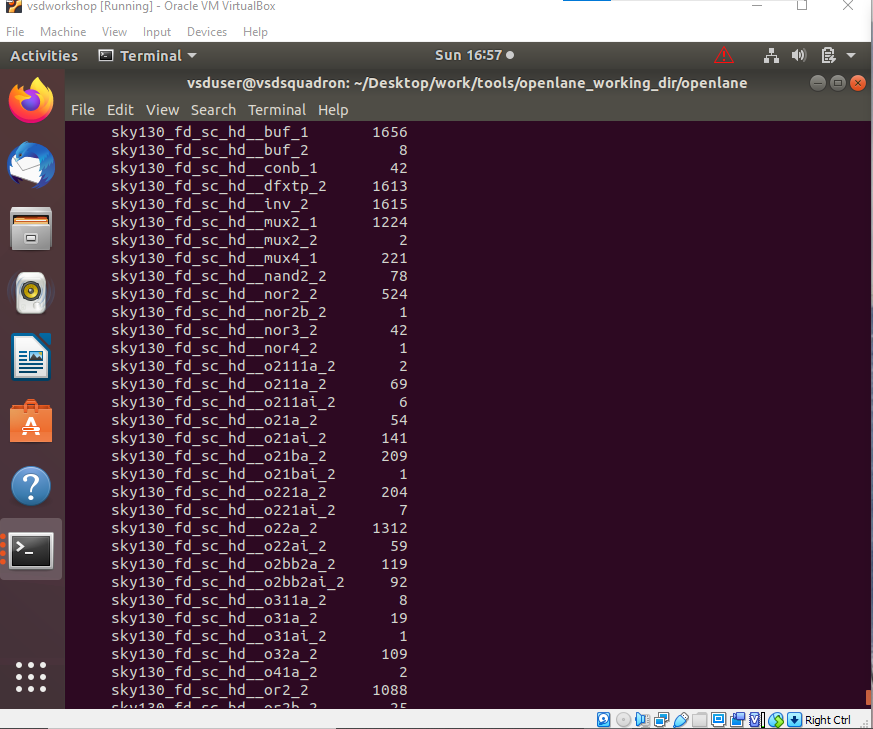

---

### Synthesis Area

The total cell area provides an indication of the amount of silicon area required by the synthesized logic.

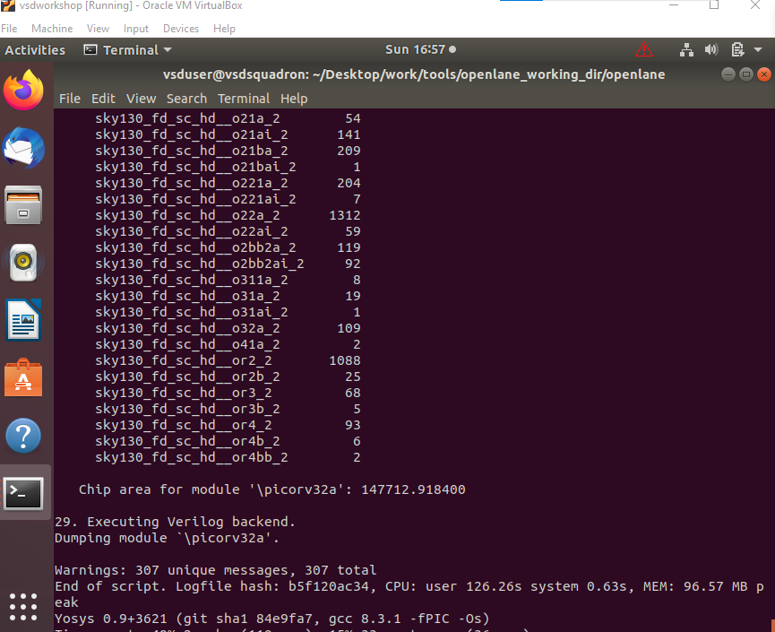

---

### Synthesis Reports

Reports generated by the synthesis flow provide information about the synthesized design and its characteristics.


---

# 🧪 Practical Work

The practical work for this module included running the OpenLANE flow for the **PicoRV32A** design.

### Design Used

```text
Design: picorv32a
Technology: Sky130
Standard Cell Library: sky130_fd_sc_hd
Flow: OpenLANE
```

### Design Preparation

```text
package require openlane 0.9
prep -design picorv32a
```

### Run Directory

The OpenLANE flow generated a run directory containing:

```text
config.tcl
logs/
reports/
results/
tmp/
PDK_SOURCES/
OPENLANE_VERSION
```

### Synthesis Output

The synthesized design generated a gate-level Verilog netlist:

```text
picorv32a.synthesis.v
```

---

# 📊 Synthesis Characterization

The synthesis results were reviewed using:

```text
Cell statistics
       ↓
Cell count
       ↓
Area
       ↓
Reports
       ↓
Timing / design information
```

### Results Collected

| Parameter | Observation |
|---|---|
| Design | PicoRV32A |
| Technology | Sky130 |
| Standard Cell Library | sky130_fd_sc_hd |
| Synthesis | Completed |
| Netlist | Generated |
| Reports | Generated |
| Cell Statistics | Reviewed |
| Area | Reviewed |

---

# 🛠️ Tools and Technologies

| Tool / Technology | Purpose |
|---|---|
| OpenLANE | RTL-to-GDS ASIC flow |
| Sky130 PDK | 130 nm process design kit |
| Yosys | RTL synthesis |
| OpenROAD | Physical implementation |
| Magic | Layout and physical verification |
| Netgen | LVS |
| OpenSTA | Static timing analysis |
| Tcl | Flow configuration and scripting |
| Git / GitHub | Version control |

---

# 🧠 Key Learnings

After completing Module 1, I understood:

- Basic chip physical organization
- Difference between package, die, core and pads
- Role of IP blocks in SoC design
- Fundamentals of RISC-V
- Relationship between software and hardware
- Components of digital ASIC design
- RTL-to-GDS flow
- Purpose of OpenLANE
- Role of the Sky130 PDK
- OpenLANE directory structure
- Design preparation
- RTL synthesis
- Synthesis reports
- Standard cell statistics
- Synthesis area characterization

---

# 📁 Repository Structure

```text
Physical_Design/
└── module_1/
    │
    ├── README.md
    │
    └── screenshots/
        ├── 01_chip_design_core.png
        ├── 02_chip_macro_ips.png
        ├── 03_openlane_flow.png
        ├── 04_software_to_hardware.png
        ├── 05_risc_v_rtl_synthesis.png
        ├── 06_open_source_eda.png
        ├── 07_rtl2gds.png
        ├── 08_openlane_detailed_flow.png
        ├── 09_openlane_directory.png
        ├── 10_design_prep.png
        ├── 11_synthesis_results.png
        ├── 12_synthesis_cells.png
        ├── 13_synthesis_area.png
        └── 14_synthesis_reports.png
```

---

# 📸 Screenshots

All screenshots documenting the practical work and lecture concepts are available in the [`screenshorts`](screenshorts/) directory.

---

# 📝 Conclusion

SKY130 Module 1 provided an introduction to the open-source ASIC design ecosystem.

The module covered the journey from **software and RTL design to physical chip implementation**, along with the fundamentals of **RISC-V, SoC design, OpenLANE, Sky130 PDK, synthesis and synthesis characterization**.

The practical exercises helped in understanding how an RTL design is prepared and synthesized using an open-source ASIC flow.

---

## 🚀 Module 1 Completed

**SKY130_D1_SK1** ✅  
How to Talk to Computers

**SKY130_D1_SK2** ✅  
SoC Design and OpenLANE

**SKY130_D1_SK3** ✅  
Open-Source EDA Tools

---
