# SKY130 Module 2 – Floorplanning, Placement and Cell Characterization

## Overview

This module covers the physical design stages after RTL synthesis, with emphasis on:

- Chip floorplanning
- Utilization factor and aspect ratio
- Pre-placed cells
- Decoupling capacitors
- Power planning
- Pin placement and placement blockages
- OpenLANE floorplan generation
- Floorplan file analysis
- Placement optimization
- Library binding and characterization
- Cell design and characterization
- Timing characterization

---

# SKY130_D2_SK1 – Chip Floorplanning Considerations

## 1. Chip Floorplanning Considerations

Floorplanning determines the dimensions and organization of the chip core and die.

Important considerations include:

- Core and die dimensions
- Utilization factor
- Aspect ratio
- Placement of standard cells
- Placement of macros and pre-placed cells
- Power distribution
- I/O pin placement
- Placement blockages


---

## 2. Utilization Factor and Aspect Ratio

The utilization factor represents the percentage of the core area occupied by the design.

**Utilization Factor:**

`Utilization Factor = Area Occupied by Netlist / Total Core Area`

**Aspect Ratio:**

`Aspect Ratio = Height / Width`

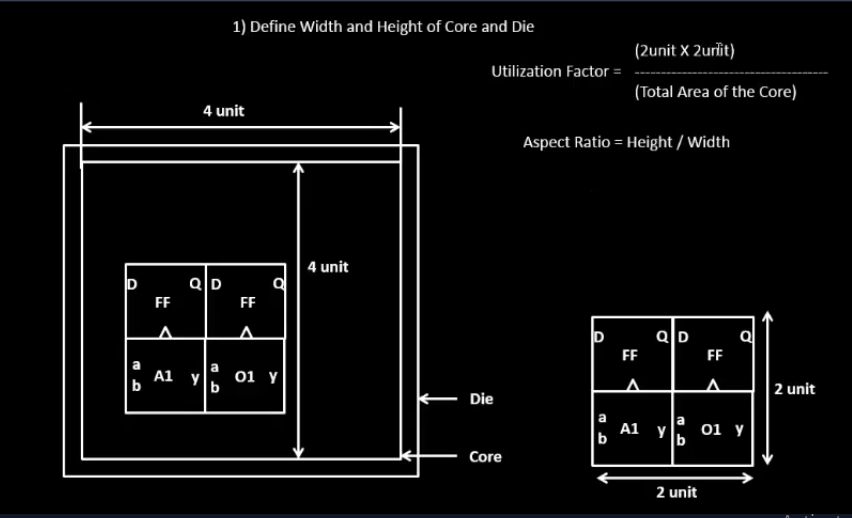

---

## 3. Pre-Placed Cells

Pre-placed cells or blocks are placed at fixed locations before standard-cell placement.

Examples include:

- Macros
- Memory blocks
- IP blocks
- Analog blocks

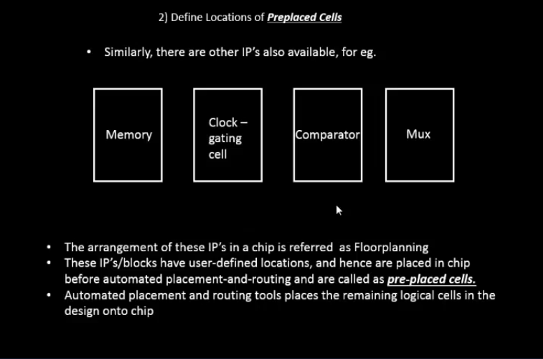

---

## 4. Decoupling Capacitors

Decoupling capacitors help stabilize the local power supply by providing temporary charge when switching activity causes voltage fluctuations.

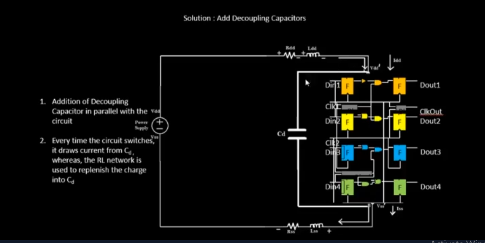

---

## 5. Power Planning

Power planning creates the power distribution network required to deliver stable VDD and VSS supplies throughout the chip.

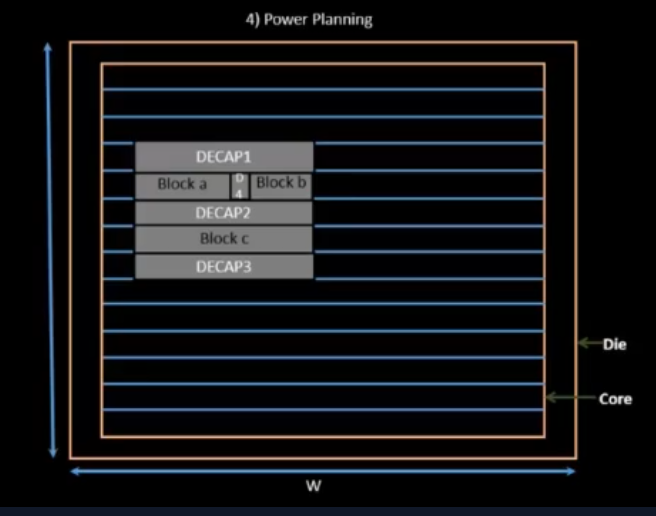

---

## 6. Pin Placement and Placement Blockages

Pin placement determines the locations of input/output pins around the chip boundary.

Placement blockages are used to prevent standard cells from being placed in reserved regions.

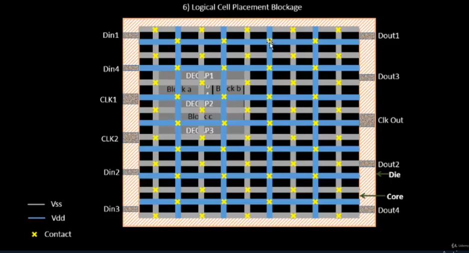

---

## 7. OpenLANE Floorplan Run

The OpenLANE flow was used to generate the floorplan for the `picorv32a` design.

The floorplan stage generates the physical representation of the synthesized design.


---

## 8. Floorplan Files

The OpenLANE floorplan stage generates physical design files such as:

- DEF
- LEF
- Floorplan data

The generated `picorv32a.floorplan.def` file contains the physical floorplan information.

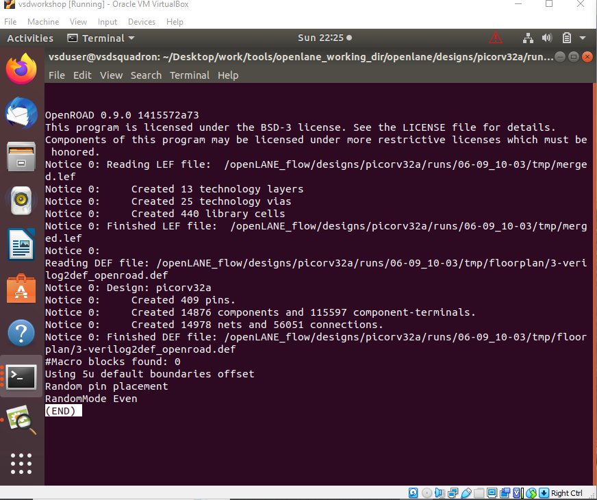

---

## 9. Floorplan Layout

The generated floorplan can be reviewed visually to understand:

- Core boundary
- Die boundary
- I/O locations
- Standard-cell region
- Power structures

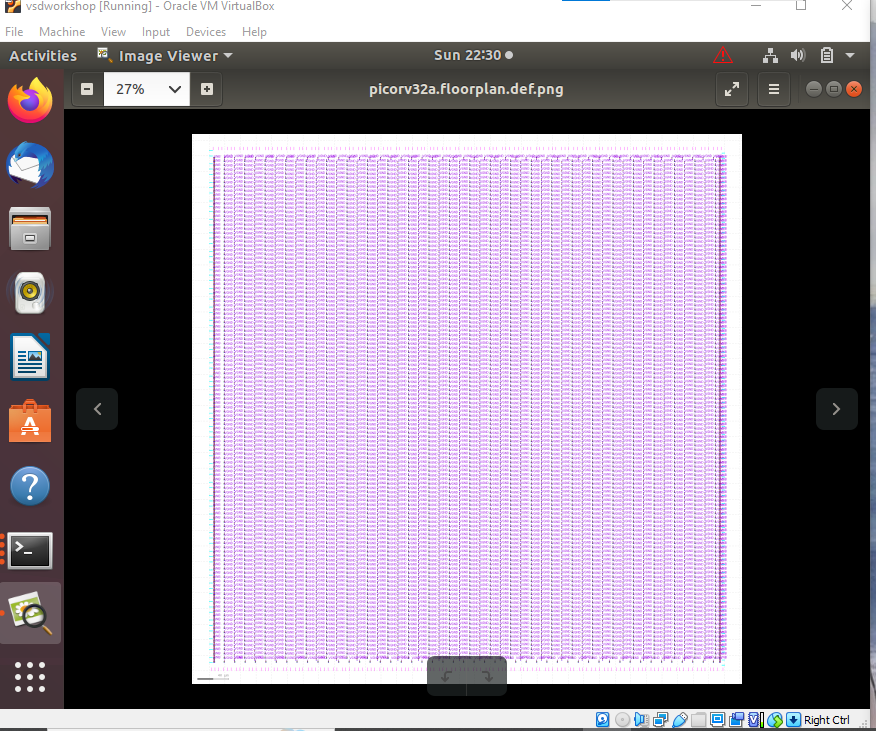

---

# SKY130_D2_SK2 – Library Binding and Placement

## 10. Placement Optimization

Placement optimization attempts to arrange cells while considering estimated:

- Wire length
- Capacitance
- Timing
- Cell density

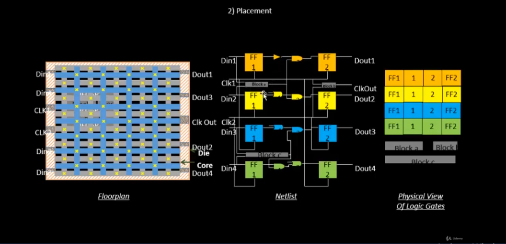

---

## 11. Final Placement Optimization

After initial placement, further optimization is performed to improve timing, wire length and placement quality.

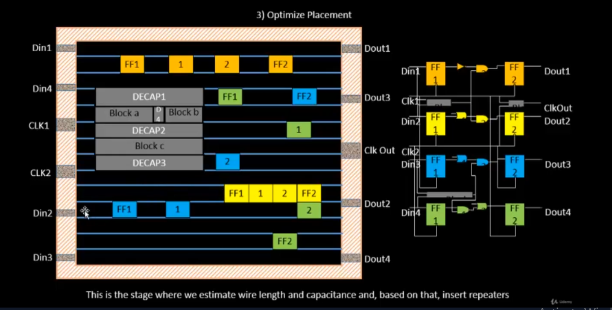

---

## 12. Library Characterization and Modelling

Standard-cell libraries contain electrical and timing information required during physical design and timing analysis.

Library characterization determines parameters such as:

- Delay
- Transition time
- Power
- Input capacitance

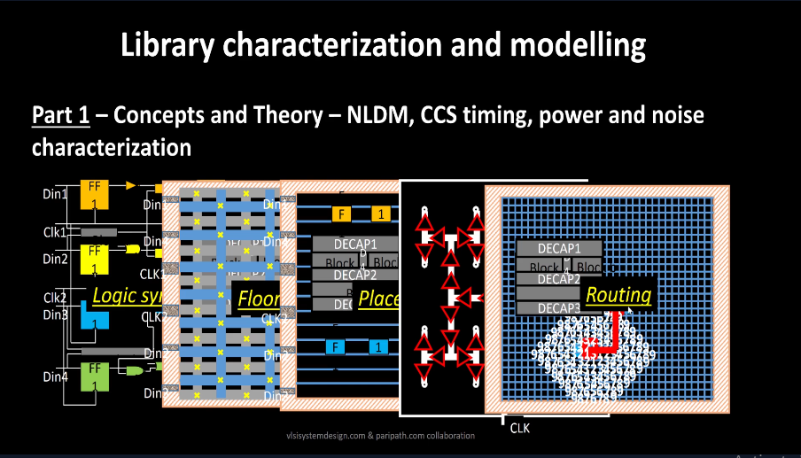

---

## 13. Netlist Binding and Initial Placement

The synthesized netlist is mapped to technology-specific standard cells from the SKY130 library.

The cells are then prepared for physical placement.

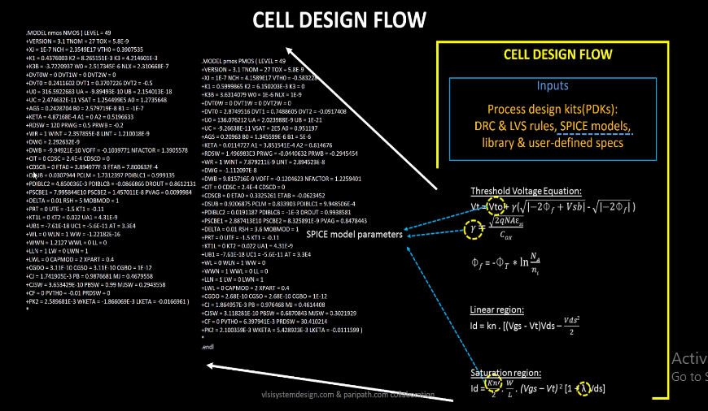

---

# SKY130_D2_SK3 – Cell Design and Characterization Flow

## 14. Circuit Design

The circuit design stage defines the transistor-level implementation of the standard cell.

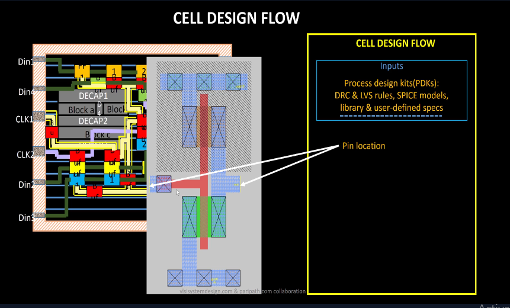

---

## 15. Cell Design Flow

The cell design process includes defining the required inputs and designing the circuit implementation according to the required functionality and performance.

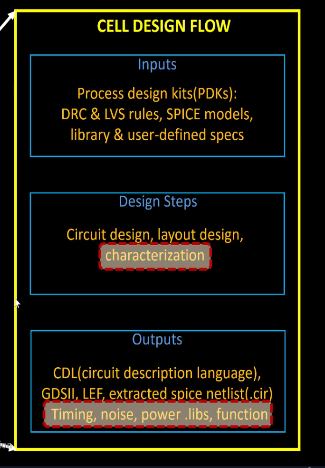

---

## 16. Layout Design

The transistor-level circuit is converted into a physical layout following the required technology design rules.

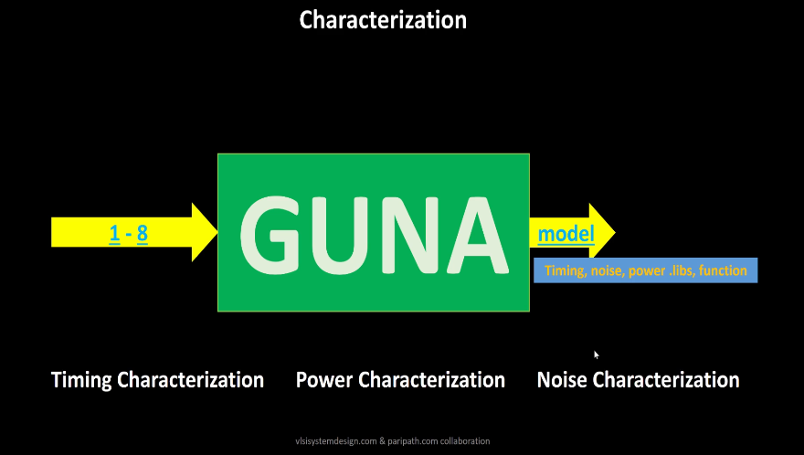

---

# SKY130_D2_SK4 – General Timing Characterization Parameters

## Timing Characterization

Timing characterization determines the delay and transition behavior of standard cells under different input conditions and loads.

Important timing parameters include:

- Input transition
- Output transition
- Propagation delay
- Timing thresholds
- Load capacitance

---

# Tools Used

- OpenLANE
- SKY130 PDK
- Yosys
- OpenROAD
- Linux
- DEF/LEF physical design files

---

# Practical Work

The practical work in this module was performed using the SKY130 OpenLANE environment.

### Design

`picorv32a`

### Floorplan Result

```text
designs/picorv32a/runs/06-09_10-03/results/floorplan/picorv32a.floorplan.def
